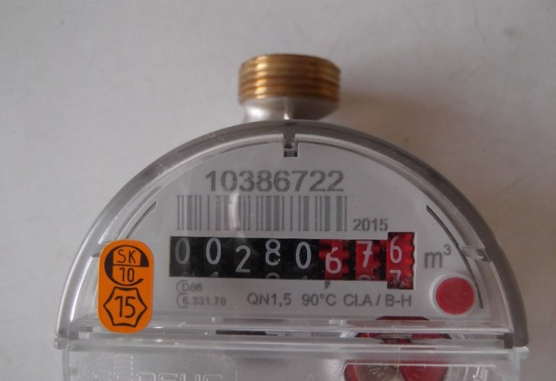
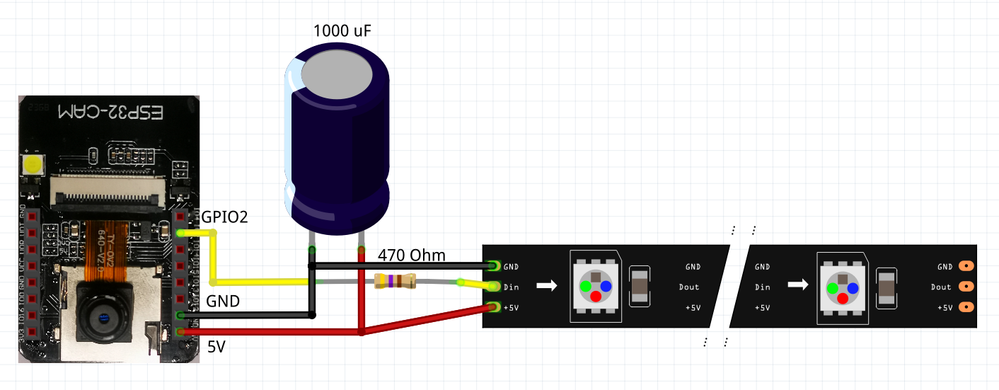

## Overview of system
The goal of this project is to read out digits from analog water meter and output the number in the home automation system, and then calculate and  show graphs of water usage in our house. I retrained the original machine learning model to fit digits of my water meters.



I know that there is possibility to attach original pulse counter module to this water meter, but the cheapest I could find cost about 65 € which I thought is enough, and I would neede pair of them. but where would be the fun part right ? Cost of this installation could be somewhere around 10 € considering you have some device capable of running docker and NodeRED containers. 

This is fork of amazing project of JomJOL which you can and you should check here https://github.com/jomjol/water-meter-system-complete
I will not describe the whole history and functions as the jomjol did great job of describing his project. 

Theoretically you should be able to grab my pre trained model from /configuration/neuralnets and use it with original jomjol container, If you need to capture only one camera per docker container. Then you wouldn't need the NodeRED part for processing. 

System consists of few basic parts.
* ESP32 Camera which is taking pictures of dials, it has function to light up some WS2812b LEDs to illuminate the darkness 
* Docker container which is gathering the photos from cameras and process the image with pre trained machine learning model. Output is plain number in the web page.
* NodeRED flow which is calling the whole process of capturing image, and processing through REST api. This gathered data is then sent to my HomeAssistant sensors.

I made some modifications to the original container, to allow processing of multiple  camera inputs, I had to disable the built in protection of handling uncorrectly readout of digits. 

## Installation water mater side
Edit settings of wifi in src/ESP32CAM_Server-GitHub.ino . Burn the firmware to device. 



I used only 3 LEDs , you can adjust this number in the config bellow wifi credentials, for better light distribution I glued silver tape to the inside of tube holding the camera, and then glued the LEDs inside. 

Here are STL files needed for this project. The main holder, which is attached to water meter, camera is held by hot glue. https://www.thingiverse.com/thing:4212917

The focus key from this link https://www.thingiverse.com/thing:4084103
and the holder for focusing the camera. Friendly tip, always focus the camera disconnected from the ESP itself, and use focus holder tool. I teared up the cable of camera when trying to focus the camera online, and then had to wait another month for spare camera.

There is alignment mask which I glued with tape to the water meter, there are 3 icons, which docker use as alignment points. I choosed this way because I am using more than one water meter, and there are slightly diffrerences between cold and hot water meters, so I could not use any of marks in image itself. [Mask file](./files/alignment_mask.docx) is word  document and it should be properly scaled. 

## Server side
You have to install docker container with following command 
```
sudo docker run -p 4000:3000 --mount type=bind,source=/opt/watermeter,target=/config --mount type=bind,source=/opt/watermeter,target=/log luc3as/water-meter
```
Container itself uses port 3000 but in this case I am redirecting it to outside port 4000 because on 3000 I have grafana running. Configuration directory is mapped to /opt/watemeter 

Configuration files together with pre learned model is attached in /configuration folder

### NodeRED Flow
```json
[{"id":"ebe381a4.dc085","type":"http request","z":"74f40a4c.7f4214","name":"Studena zapni svetlo","method":"GET","ret":"txt","paytoqs":false,"url":"http://192.168.3.121/lighton","tls":"","persist":false,"proxy":"","authType":"","x":360,"y":80,"wires":[["d15ccf04.1f8f3","48d6f009.57acd"]]},{"id":"bb4710df.86795","type":"inject","z":"74f40a4c.7f4214","name":"Start studena","topic":"","payload":"","payloadType":"date","repeat":"900","crontab":"","once":true,"onceDelay":"3","x":140,"y":20,"wires":[["ebe381a4.dc085"]]},{"id":"d15ccf04.1f8f3","type":"debug","z":"74f40a4c.7f4214","name":"","active":false,"tosidebar":true,"console":false,"tostatus":false,"complete":"true","targetType":"full","x":630,"y":20,"wires":[]},{"id":"871ecdf.a36253","type":"inject","z":"74f40a4c.7f4214","name":"Start tepla","topic":"","payload":"","payloadType":"str","repeat":"","crontab":"","once":false,"onceDelay":0.1,"x":140,"y":500,"wires":[["71cc7661.997098"]]},{"id":"dd8f2fb5.af42","type":"inject","z":"74f40a4c.7f4214","name":"Push","topic":"","payload":"","payloadType":"str","repeat":"","crontab":"","once":false,"onceDelay":0.1,"x":170,"y":660,"wires":[["6a4b430d.5a033c"]]},{"id":"872b678c.d22658","type":"inject","z":"74f40a4c.7f4214","name":"Push","topic":"","payload":"","payloadType":"str","repeat":"","crontab":"","once":false,"onceDelay":0.1,"x":150,"y":200,"wires":[["9de5641c.0528b8"]]},{"id":"e885d6b.a817028","type":"inject","z":"74f40a4c.7f4214","name":"Push","topic":"","payload":"","payloadType":"str","repeat":"","crontab":"","once":false,"onceDelay":0.1,"x":150,"y":140,"wires":[["d961a25d.c69b6"]]},{"id":"7e65c05b.e7be1","type":"inject","z":"74f40a4c.7f4214","name":"Push","topic":"","payload":"","payloadType":"str","repeat":"","crontab":"","once":false,"onceDelay":0.1,"x":170,"y":600,"wires":[["455969ed.a248c8"]]},{"id":"71cc7661.997098","type":"http request","z":"74f40a4c.7f4214","name":"Tepla zapni svetlo","method":"GET","ret":"txt","paytoqs":false,"url":"http://192.168.3.118/lighton","tls":"","persist":false,"proxy":"","authType":"","x":370,"y":540,"wires":[["d15ccf04.1f8f3","93e00b50.1dac28"]]},{"id":"9de5641c.0528b8","type":"http request","z":"74f40a4c.7f4214","name":"Studena vypni svetlo","method":"GET","ret":"txt","paytoqs":false,"url":"http://192.168.3.121/lightoff","tls":"","persist":false,"proxy":"","authType":"","x":360,"y":200,"wires":[["d15ccf04.1f8f3","97a8f848.fe3a08"]]},{"id":"6a4b430d.5a033c","type":"http request","z":"74f40a4c.7f4214","name":"Tepla vypni svetlo","method":"GET","ret":"txt","paytoqs":false,"url":"http://192.168.3.118/lightoff","tls":"","persist":false,"proxy":"","authType":"","x":370,"y":660,"wires":[["d15ccf04.1f8f3","eea1449d.9d5018"]]},{"id":"d961a25d.c69b6","type":"http request","z":"74f40a4c.7f4214","name":"Spracuj studenu vodu","method":"GET","ret":"txt","paytoqs":false,"url":"http://192.168.1.245:4000/wasserzaehler.html?single&url=http://192.168.3.121/capture_with_light?size=SVGA&quality=5","tls":"","persist":false,"proxy":"","authType":"","x":360,"y":140,"wires":[["9de5641c.0528b8","d0cdf487.23a3c8","15bf68ee.7708b7","44a51ac2.4f0494"]]},{"id":"455969ed.a248c8","type":"http request","z":"74f40a4c.7f4214","name":"Spracuj teplu vodu","method":"GET","ret":"txt","paytoqs":false,"url":"http://192.168.1.245:4000/wasserzaehler.html?single&url=http://192.168.3.118/capture_with_light?size=SVGA&quality=5","tls":"","persist":false,"proxy":"","authType":"","x":370,"y":600,"wires":[["6a4b430d.5a033c","73ffc891.e3a698","50aad552.b2155c"]]},{"id":"48d6f009.57acd","type":"switch","z":"74f40a4c.7f4214","name":"If OK ","property":"statusCode","propertyType":"msg","rules":[{"t":"eq","v":"200","vt":"num"}],"checkall":"true","repair":false,"outputs":1,"x":610,"y":80,"wires":[["2218d5d7.bc8c3a"]]},{"id":"2218d5d7.bc8c3a","type":"delay","z":"74f40a4c.7f4214","name":"","pauseType":"delay","timeout":"5","timeoutUnits":"seconds","rate":"1","nbRateUnits":"1","rateUnits":"second","randomFirst":"1","randomLast":"5","randomUnits":"seconds","drop":false,"x":760,"y":80,"wires":[["d961a25d.c69b6"]]},{"id":"93e00b50.1dac28","type":"switch","z":"74f40a4c.7f4214","name":"If OK ","property":"statusCode","propertyType":"msg","rules":[{"t":"eq","v":"200","vt":"num"}],"checkall":"true","repair":false,"outputs":1,"x":610,"y":520,"wires":[["c5ccd8b8.b6b958"]]},{"id":"d0cdf487.23a3c8","type":"delay","z":"74f40a4c.7f4214","name":"","pauseType":"delay","timeout":"5","timeoutUnits":"seconds","rate":"1","nbRateUnits":"1","rateUnits":"second","randomFirst":"1","randomLast":"5","randomUnits":"seconds","drop":false,"x":620,"y":200,"wires":[["3cfd51bf.724f5e"]]},{"id":"c5ccd8b8.b6b958","type":"delay","z":"74f40a4c.7f4214","name":"","pauseType":"delay","timeout":"5","timeoutUnits":"seconds","rate":"1","nbRateUnits":"1","rateUnits":"second","randomFirst":"1","randomLast":"5","randomUnits":"seconds","drop":false,"x":760,"y":520,"wires":[["455969ed.a248c8"]]},{"id":"22e88ae2.2846c6","type":"image","z":"74f40a4c.7f4214","name":"","width":160,"data":"payload","dataType":"msg","thumbnail":false,"active":true,"x":1060,"y":140,"wires":[]},{"id":"15bf68ee.7708b7","type":"switch","z":"74f40a4c.7f4214","name":"If OK ","property":"statusCode","propertyType":"msg","rules":[{"t":"eq","v":"200","vt":"num"}],"checkall":"true","repair":false,"outputs":1,"x":730,"y":140,"wires":[["30f2c850.ec0748"]]},{"id":"73ffc891.e3a698","type":"switch","z":"74f40a4c.7f4214","name":"If OK ","property":"statusCode","propertyType":"msg","rules":[{"t":"eq","v":"200","vt":"num"}],"checkall":"true","repair":false,"outputs":1,"x":730,"y":600,"wires":[["80c5e3cc.b9347"]]},{"id":"80c5e3cc.b9347","type":"jimp-image","z":"74f40a4c.7f4214","name":"","data":"http://192.168.1.245:4000/image_tmp/alg.jpg","dataType":"str","ret":"img","parameter1":"FONT_SANS_128_WHITE","parameter1Type":"jimpFont","parameter2":"50","parameter2Type":"num","parameter3":"450","parameter3Type":"num","parameter4":"payload","parameter4Type":"msg","parameter5":"","parameter5Type":"msg","parameter6":"","parameter6Type":"msg","parameter7":"","parameter7Type":"msg","parameter8":"","parameter8Type":"msg","parameterCount":6,"jimpFunction":"print","selectedJimpFunction":{"name":"print","fn":"print","description":"Print text to the image","parameters":[{"name":"font","type":"jimpFont","required":true,"hint":"font to print"},{"name":"x","type":"num","required":true,"hint":"x coordinate to print text"},{"name":"y","type":"num","required":true,"hint":"y coordinate to print text"},{"name":"text","type":"str","required":true,"hint":"text to print"},{"name":"maxWidth","type":"num","required":false,"hint":"wrap text at maxWidth"},{"name":"maxHeight","type":"num","required":false,"hint":""}]},"x":890,"y":600,"wires":[["bd7a789c.c2da78"]]},{"id":"bd7a789c.c2da78","type":"image","z":"74f40a4c.7f4214","name":"","width":160,"data":"payload","dataType":"msg","thumbnail":false,"active":true,"x":1060,"y":600,"wires":[]},{"id":"56d5002c.8678","type":"ha-entity","z":"74f40a4c.7f4214","name":"Studena voda celkom","server":"74f8257b.77137c","version":1,"debugenabled":false,"outputs":1,"entityType":"sensor","config":[{"property":"name","value":"Celková spotreba studenej vody"},{"property":"device_class","value":""},{"property":"icon","value":""},{"property":"unit_of_measurement","value":"m3"}],"state":"payload","stateType":"msg","attributes":[],"resend":true,"outputLocation":"","outputLocationType":"none","inputOverride":"allow","x":1080,"y":320,"wires":[[]]},{"id":"7ce1fa90.f3f4b4","type":"function","z":"74f40a4c.7f4214","name":"Sprav cislo","func":"if(!msg.payload.includes('N')) {\n    msg.payload = msg.payload.trim();\n    msg.payload = msg.payload.slice(0, 5) + '.' + msg.payload.slice(-3);\n    msg.payload = msg.payload.replace(/^0+/, \"\")\n    node.status({fill:\"green\",shape:\"dot\",text:\"Valid data\"});\n    return [msg,null];\n} else {        // We have invalid data\n    node.status({fill:\"red\",shape:\"dot\",text:\"Invalid data\"});\n    return [null,msg];\n}","outputs":2,"noerr":0,"x":830,"y":320,"wires":[["56d5002c.8678","66398ffd.90f5a"],["a0d62dc0.b89ec"]]},{"id":"a9907136.25dc6","type":"function","z":"74f40a4c.7f4214","name":"Sprav cislo","func":"if(!msg.payload.includes('N')) {\n    msg.payload = msg.payload.trim();\n    msg.payload = msg.payload.slice(0, 5) + '.' + msg.payload.slice(-3);\n    msg.payload = msg.payload.replace(/^0+/, \"\")\n    node.status({fill:\"green\",shape:\"dot\",text:\"Valid data\"});\n    return [msg,null];\n} else {        // We have invalid data\n    node.status({fill:\"red\",shape:\"dot\",text:\"Invalid data\"});\n    return [null,msg];\n}","outputs":2,"noerr":0,"x":790,"y":740,"wires":[["6185a065.7334a","cf78daf4.cf6028"],["948d0023.d181e"]]},{"id":"6185a065.7334a","type":"ha-entity","z":"74f40a4c.7f4214","name":"Tepla voda celkom","server":"74f8257b.77137c","version":1,"debugenabled":false,"outputs":1,"entityType":"sensor","config":[{"property":"name","value":"Celková spotreba teplej vody"},{"property":"device_class","value":""},{"property":"icon","value":""},{"property":"unit_of_measurement","value":"m3"}],"state":"payload","stateType":"msg","attributes":[],"resend":true,"outputLocation":"","outputLocationType":"none","inputOverride":"allow","x":1070,"y":780,"wires":[[]]},{"id":"44a51ac2.4f0494","type":"switch","z":"74f40a4c.7f4214","name":"If OK ","property":"statusCode","propertyType":"msg","rules":[{"t":"eq","v":"200","vt":"num"}],"checkall":"true","repair":false,"outputs":1,"x":650,"y":300,"wires":[["7ce1fa90.f3f4b4"]]},{"id":"50aad552.b2155c","type":"switch","z":"74f40a4c.7f4214","name":"If OK ","property":"statusCode","propertyType":"msg","rules":[{"t":"eq","v":"200","vt":"num"}],"checkall":"true","repair":false,"outputs":1,"x":610,"y":700,"wires":[["a9907136.25dc6"]]},{"id":"bc4aef12.fccb9","type":"inject","z":"74f40a4c.7f4214","name":"Test","topic":"","payload":"00002383\t","payloadType":"str","repeat":"","crontab":"","once":false,"onceDelay":"3","x":650,"y":360,"wires":[["7ce1fa90.f3f4b4"]]},{"id":"f35bd68d.486b78","type":"inject","z":"74f40a4c.7f4214","name":"Test","topic":"","payload":"00064786","payloadType":"str","repeat":"","crontab":"","once":false,"onceDelay":"3","x":610,"y":800,"wires":[["a9907136.25dc6"]]},{"id":"30f2c850.ec0748","type":"jimp-image","z":"74f40a4c.7f4214","name":"","data":"http://192.168.1.245:4000/image_tmp/alg.jpg","dataType":"str","ret":"img","parameter1":"FONT_SANS_128_WHITE","parameter1Type":"jimpFont","parameter2":"50","parameter2Type":"num","parameter3":"450","parameter3Type":"num","parameter4":"payload","parameter4Type":"msg","parameter5":"","parameter5Type":"msg","parameter6":"","parameter6Type":"msg","parameter7":"","parameter7Type":"msg","parameter8":"","parameter8Type":"msg","parameterCount":6,"jimpFunction":"print","selectedJimpFunction":{"name":"print","fn":"print","description":"Print text to the image","parameters":[{"name":"font","type":"jimpFont","required":true,"hint":"font to print"},{"name":"x","type":"num","required":true,"hint":"x coordinate to print text"},{"name":"y","type":"num","required":true,"hint":"y coordinate to print text"},{"name":"text","type":"str","required":true,"hint":"text to print"},{"name":"maxWidth","type":"num","required":false,"hint":"wrap text at maxWidth"},{"name":"maxHeight","type":"num","required":false,"hint":""}]},"x":890,"y":140,"wires":[["22e88ae2.2846c6"]]},{"id":"258b18fa.9fb7d8","type":"influxdb out","z":"74f40a4c.7f4214","influxdb":"a29f7469.184588","name":"Save to InfluxDB","measurement":"vodomery","precision":"","retentionPolicy":"","x":1070,"y":840,"wires":[]},{"id":"cf78daf4.cf6028","type":"function","z":"74f40a4c.7f4214","name":"to DB","func":"var value = Number(msg.payload);\nmsg.payload = {\n    value: value,\n    id: \"tepla-voda\"\n}\nreturn msg;","outputs":1,"noerr":0,"x":890,"y":840,"wires":[["258b18fa.9fb7d8","c5a5430f.3d448"]]},{"id":"c5a5430f.3d448","type":"debug","z":"74f40a4c.7f4214","name":"","active":false,"tosidebar":true,"console":false,"tostatus":false,"complete":"true","targetType":"full","x":1030,"y":880,"wires":[]},{"id":"bdd70d35.2a944","type":"inject","z":"74f40a4c.7f4214","name":"Test","topic":"","payload":"00064706","payloadType":"str","repeat":"","crontab":"","once":false,"onceDelay":"3","x":610,"y":760,"wires":[["a9907136.25dc6"]]},{"id":"181d8c30.2b4894","type":"influxdb out","z":"74f40a4c.7f4214","influxdb":"a29f7469.184588","name":"Save to InfluxDB","measurement":"vodomery","precision":"","retentionPolicy":"","x":1070,"y":380,"wires":[]},{"id":"66398ffd.90f5a","type":"function","z":"74f40a4c.7f4214","name":"to DB","func":"var value = Number(msg.payload);\nmsg.payload = {\n    value: value,\n    id: \"studena-voda\"\n}\nreturn msg;","outputs":1,"noerr":0,"x":890,"y":380,"wires":[["181d8c30.2b4894","ad2adfa6.709c1"]]},{"id":"ad2adfa6.709c1","type":"debug","z":"74f40a4c.7f4214","name":"","active":false,"tosidebar":true,"console":false,"tostatus":false,"complete":"true","targetType":"full","x":1030,"y":420,"wires":[]},{"id":"a0d62dc0.b89ec","type":"delay","z":"74f40a4c.7f4214","name":"","pauseType":"delay","timeout":"5","timeoutUnits":"minutes","rate":"1","nbRateUnits":"1","rateUnits":"second","randomFirst":"1","randomLast":"5","randomUnits":"seconds","drop":false,"x":820,"y":240,"wires":[["317e13f4.038b4c"]]},{"id":"948d0023.d181e","type":"delay","z":"74f40a4c.7f4214","name":"","pauseType":"delay","timeout":"5","timeoutUnits":"minutes","rate":"1","nbRateUnits":"1","rateUnits":"second","randomFirst":"1","randomLast":"5","randomUnits":"seconds","drop":false,"x":820,"y":680,"wires":[["e35f37e4.d14c18"]]},{"id":"e35f37e4.d14c18","type":"delay","z":"74f40a4c.7f4214","name":"","pauseType":"rate","timeout":"5","timeoutUnits":"seconds","rate":"1","nbRateUnits":"5","rateUnits":"minute","randomFirst":"1","randomLast":"5","randomUnits":"seconds","drop":true,"x":720,"y":640,"wires":[["71cc7661.997098"]]},{"id":"317e13f4.038b4c","type":"delay","z":"74f40a4c.7f4214","name":"","pauseType":"rate","timeout":"5","timeoutUnits":"seconds","rate":"1","nbRateUnits":"5","rateUnits":"minute","randomFirst":"1","randomLast":"5","randomUnits":"seconds","drop":true,"x":840,"y":200,"wires":[["ebe381a4.dc085"]]},{"id":"3cfd51bf.724f5e","type":"delay","z":"74f40a4c.7f4214","name":"","pauseType":"rate","timeout":"5","timeoutUnits":"seconds","rate":"1","nbRateUnits":"5","rateUnits":"minute","randomFirst":"1","randomLast":"5","randomUnits":"seconds","drop":true,"x":380,"y":300,"wires":[["71cc7661.997098"]]},{"id":"8b91cc0a.99ee2","type":"influxdb in","z":"74f40a4c.7f4214","influxdb":"809c26b4.df3d58","name":"Today studena","query":"","rawOutput":false,"precision":"","retentionPolicy":"","x":720,"y":460,"wires":[["702f3dc0.77ecc4"]]},{"id":"38739c3f.69aa94","type":"debug","z":"74f40a4c.7f4214","name":"","active":false,"tosidebar":true,"console":false,"tostatus":false,"complete":"true","targetType":"full","x":1030,"y":520,"wires":[]},{"id":"97a8f848.fe3a08","type":"function","z":"74f40a4c.7f4214","name":"Vytiahni studenu za dnes","func":"var todayMidnight = new Date(new Date().setHours(0,0,0,0)).getTime();\nvar todayEnd = new Date(new Date().setHours(23,59,59,0)).getTime();\nmsg.query = 'SELECT mean(\"value\") *1000 FROM \"vodomery\" WHERE \\\n(\"id\" = \\'studena-voda\\') AND time >= ' + todayMidnight + 'ms and time <= ' + todayEnd + 'ms  GROUP BY time(15m) fill(none)';\nreturn msg;","outputs":1,"noerr":0,"x":490,"y":460,"wires":[["8b91cc0a.99ee2"]]},{"id":"702f3dc0.77ecc4","type":"function","z":"74f40a4c.7f4214","name":"Zrataj","func":"if (msg.payload.length > 1 ) {\n    delete msg.query; \n    msg.payload = msg.payload[msg.payload.length -1].mean - msg.payload[0].mean;\n    msg.payload = Math.round(msg.payload * 10 ) / 10;\n} else {\n    msg.payload = 0;\n}\nreturn msg;","outputs":1,"noerr":0,"x":890,"y":460,"wires":[["38739c3f.69aa94","9b7c7c2f.7b4b4"]]},{"id":"9b7c7c2f.7b4b4","type":"ha-entity","z":"74f40a4c.7f4214","name":"Studena voda dnes","server":"74f8257b.77137c","version":1,"debugenabled":false,"outputs":1,"entityType":"sensor","config":[{"property":"name","value":"Dnešná spotreba studenej vody"},{"property":"device_class","value":""},{"property":"icon","value":""},{"property":"unit_of_measurement","value":"L"}],"state":"payload","stateType":"msg","attributes":[],"resend":true,"outputLocation":"","outputLocationType":"none","inputOverride":"allow","x":1070,"y":460,"wires":[[]]},{"id":"c4c3f817.16f118","type":"influxdb in","z":"74f40a4c.7f4214","influxdb":"a29f7469.184588","name":"Today tepla","query":"","rawOutput":false,"precision":"","retentionPolicy":"","x":710,"y":920,"wires":[["c43e30d.7fa98d"]]},{"id":"64a71415.6e6eac","type":"debug","z":"74f40a4c.7f4214","name":"","active":false,"tosidebar":true,"console":false,"tostatus":false,"complete":"true","targetType":"full","x":1030,"y":980,"wires":[]},{"id":"eea1449d.9d5018","type":"function","z":"74f40a4c.7f4214","name":"Vytiahni teplu za dnes","func":"var todayMidnight = new Date(new Date().setHours(0,0,0,0)).getTime();\nvar todayEnd = new Date(new Date().setHours(23,59,59,0)).getTime();\nmsg.query = 'SELECT mean(\"value\") *1000 FROM \"vodomery\" WHERE \\\n(\"id\" = \\'tepla-voda\\') AND time >= ' + todayMidnight + 'ms and time <= ' + todayEnd + 'ms  GROUP BY time(15m) fill(none)';\nreturn msg;","outputs":1,"noerr":0,"x":480,"y":920,"wires":[["c4c3f817.16f118"]]},{"id":"c43e30d.7fa98d","type":"function","z":"74f40a4c.7f4214","name":"Zrataj","func":"if (msg.payload.length > 1 ) {\n    delete msg.query; \n    msg.payload = msg.payload[msg.payload.length -1].mean - msg.payload[0].mean;\n    msg.payload = Math.round(msg.payload * 10 ) / 10;\n} else {\n    msg.payload = 0;\n}\nreturn msg;","outputs":1,"noerr":0,"x":890,"y":920,"wires":[["64a71415.6e6eac","c8279c55.c26dc"]]},{"id":"c8279c55.c26dc","type":"ha-entity","z":"74f40a4c.7f4214","name":"Tepla voda dnes","server":"74f8257b.77137c","version":1,"debugenabled":false,"outputs":1,"entityType":"sensor","config":[{"property":"name","value":"Dnešná spotreba teplej vody"},{"property":"device_class","value":""},{"property":"icon","value":""},{"property":"unit_of_measurement","value":"L"}],"state":"payload","stateType":"msg","attributes":[],"resend":true,"outputLocation":"","outputLocationType":"none","inputOverride":"allow","x":1060,"y":920,"wires":[[]]},{"id":"40e0b793.de6888","type":"inject","z":"74f40a4c.7f4214","name":"O polnoci","topic":"","payload":"","payloadType":"date","repeat":"","crontab":"01 00 * * *","once":false,"onceDelay":"3","x":230,"y":380,"wires":[["97a8f848.fe3a08"]]},{"id":"83ded871.febe28","type":"inject","z":"74f40a4c.7f4214","name":"O polnoci","topic":"","payload":"","payloadType":"date","repeat":"","crontab":"01 00 * * *","once":false,"onceDelay":"3","x":210,"y":860,"wires":[["eea1449d.9d5018"]]},{"id":"74f8257b.77137c","type":"server","z":"","name":"Home Assistant","legacy":false,"addon":true,"rejectUnauthorizedCerts":true,"ha_boolean":"y|yes|true|on|home|open","connectionDelay":true},{"id":"a29f7469.184588","type":"influxdb","z":"","hostname":"127.0.0.1","port":"8086","protocol":"http","database":"hass","name":"HASS InfluxDB","usetls":false,"tls":""}]
```

You have to edit the IP addresses of docker container running, and IPs of cameras. I am storing the data to influx DB as I already had it installed and running, you could probably skip this part of flow, and send the data through for example MQTT.


## Retraining the model
If you would like to learn something, and want to retrain the model from your own images, I will try to describe the process. 

Firt you have to enable "debug" so the container will save all images it parses, to folder, which you can categorise by hand to corresponding folder. 
To do so , uncomment this line #LogImageLocation under [Digital_Digit] section

I used Google Colab so I didn't have to spend single minute by installing python, all necessary libraries and some enviroment to work with. 

Here is modified all in one jupyter notebook with some self explanating code snippets I believe. At the end, you should have saved h5 file which you can use in /configuration/neuralnets folder, and edit the config file to use this new model. 

[Train_picture_classification.ipynb](./files/Train_picture_classification.ipynb)


### If You liked my work, You can buy me a coffee :)

<a class="" target="_blank" href="https://www.buymeacoffee.com/luc3as"></a>

### Or send some crypto

<a class="" target="_blank" href="https://lukasporubcan.sk/donate"></a>	
			